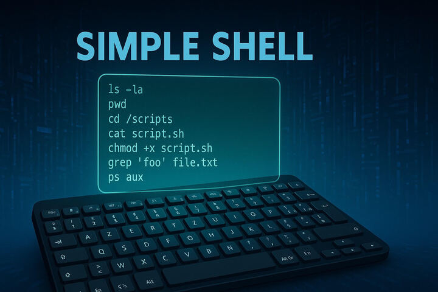

<p align="center">

</p>

# Simple shell - Holberton School Project 🧑‍🎓


### Welcome to our Shell project ! 📟

As part of our journey at Holberton School, we teamed up a group of three students to build our own simple shell in C.
This project was both a fun challenge and a great opportunity to dive deeper into the world of system programming.

## Table of contents 📄

<details>
  <summary>Click to enlarge 😇</summary>

- [Detailed Description 📝](#detailed-description-)
- [Requirements ❗](#requirements-)
- [Authorized Functions and System Calls 📢](#authorized-functions-and-system-calls-)
- [Compilation 💻](#compilation-)
- [Tech Stack 🧩](#tech-stack-)
- [Authors 🤝](#authors-)
</details>

## Detailed Description 📝

In this project, we've built a basic shell in C that mimics the core functionality of Unix shells like Bash. It supports command execution, argument parsing, built-in commands, path searching, and proper error handling in both interactive and non-interactive modes.

## Requirements ❗

+ Allowed editors: vi, vim, emacs
+ All your files will be compiled on Ubuntu 20.04 LTS using gcc, using the options -Wall -Werror -Wextra -pedantic -std=gnu89
+ All your files should end with a new line
+ A README.md file, at the root of the folder of the project is mandatory
+ Your code should use the Betty style. It will be checked using betty-style.pl and betty-doc.pl
+ Your shell should not have any memory leaks
+ No more than 5 functions per file
+ All your header files should be include guarded

## Authorized Functions and System Calls 📢


### All functions from string.h 🔐
+ access (man 2 access)
+ chdir (man 2 chdir)
+ close (man 2 close)
+ closedir (man 3 closedir)
+ execve (man 2 execve)
+ exit (man 3 exit)
+ _exit (man 2 _exit)
+ fflush (man 3 fflush)
+ fork (man 2 fork)
+ free (man 3 free)
+ getcwd (man 3 getcwd)
+ getline (man 3 getline)
+ getpid (man 2 getpid)
+ isatty (man 3 isatty)
+ kill (man 2 kill)
+ malloc (man 3 malloc)
+ open (man 2 open)
+ opendir (man 3 opendir)
+ perror (man 3 perror)
+ printf (man 3 printf)
+ fprintf (man 3 fprintf)
+ vfprintf (man 3 vfprintf)
+ sprintf (man 3 sprintf)
+ putchar (man 3 putchar)
+ read (man 2 read)
+ readdir (man 3 readdir)
+ signal (man 2 signal)
+ stat (__xstat) (man 2 stat)
+ lstat (__lxstat) (man 2 lstat)
+ fstat (__fxstat) (man 2 fstat)
+ strtok (man 3 strtok)
+ wait (man 2 wait)
+ waitpid (man 2 waitpid)
+ wait3 (man 2 wait3)
+ wait4 (man 2 wait4)
+ write (man 2 write)

## Compilation 💻

Your project will be compiled on Ubuntu 20.04 LTS using gcc with the following compilation flags  :

````
gcc -Wall -Werror -Wextra -pedantic -std=gnu89 -Wno-format *.c -o hsh
````

## Tech Stack 🧩

<div style="display: flex; justify-content: center; align-items: center; gap: 10px;">
	
    &emsp;
	
	&emsp;
	
    &emsp;
    
</div>

## Authors 🤝

👨‍💻 Abdellah Dydouh : [azbin-spec](https://github.com/azbin-spec) / 9777@holbertonstudents.com

🧑‍💻 Theo Dessaigne : [Theo-D](https://github.com/Theo-D) / 10540@holbertonstudents.com

🧑‍💻 Louis Manchon : [LouisManchon](https://github.com/LouisManchon) / 10578@holbertonstudents.com

<p align="center">
    
<p/>
